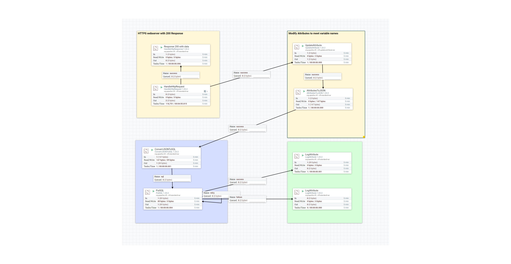

# NIFI-GPSLogger-with-SSL
Creates a NIFI https server, which ingests data from GPSLogger for Android application over SSL and writes to a PostgreSQL database.

## GPS Logger for Android
Get it here: https://gpslogger.app/

After that you can use the gpslogger_profil.properties file to import the profile. The id variable in the URL can be modified, to correspond with the tablet user, all other values should be left as they are. You may after some testing also modify additional settings as per your requirements.

IMPORTANT: Before starting to log, also import the SSL certificate into the apps truststore. For details check the app manual: <https://gpslogger.app/#customsslcertificates>

## Apache NIFI
Get it here: https://nifi.apache.org/download.html and after installation, import the template.

After entering the process group you should see the following nifi flow:

Modify the **StandardRestrictedSSLContextServiceGPSlogger** so that it corresponds with your keystore.jks location and the credentials.

## PostgreSQL database

Requires a table, in the underlying template named "gpslogger3" with the following schema:

- lat double precision Latitude
- long double precision Longitude
- id text user id included in the url
- aid text android id
- time text time
- acc double precision accuracy
- bat double precision battery percentage

If your table has a different name, then modify in the **ConvertJSONToSQL** properties. Modify your database location path and name in the **DBCPConnectionPoolPostgreSQL** Controller Service.

## Create self-signed certificat
sudo ./keytool -genkey -alias [server-alias] -keyalg RSA \
   -keypass [yourpassword] -storepass [yourpassword] -keystore keystore.jks \
   -ext "SAN=IP:192.168.100.254" \
   -dname "CN=192.168.100.254"

The URLs provided above must match the URLs you are using, so you have to replace it.
   
after hitting enter you will then need to provide additional user information for the certificate. Important is also that you provide the SAME entry which you have under -dname in the first name/last name question which appears immedeatly after running this command.

Copy the keystore.jks file to a folder where nifi can read it, and update the SSLcontext service with your path and your credentials. That shold be it.

Happy logging!
